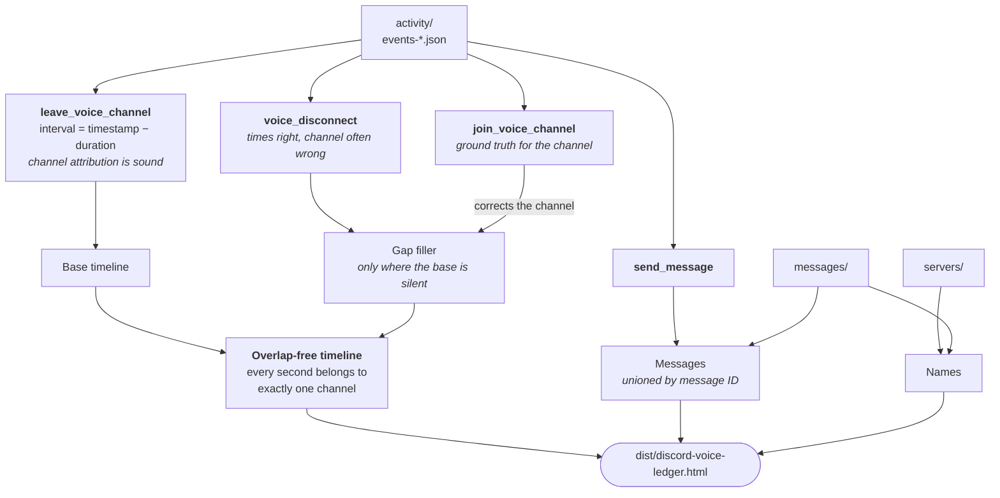

# Discord Voice Ledger

**How much time did you actually spend talking — and with whom?**

Discord knows. It has been writing down every voice connection you ever made,
and it hands the record to you if you ask for it. The trouble is that the record
arrives as a couple of gigabytes of raw event logs, and one of the two obvious
ways to read it is quietly wrong.

This tool reads that export and turns it into a single HTML file: voice time per
server, voice time per person, messages, over time, with the arithmetic shown.

`no dependencies` · `no network calls` · `Node 18+` · `MIT`

<sup>Those are plain text, not badge images — a page that claims never to reach
the network should not make your browser fetch four pictures from a CDN to say
so.</sup>

---

## Try it in one minute

You do not need your own data to see what this is. The repository ships a
generator for a synthetic package — invented people, invented servers, invented
conversations, and all the awkward edge cases of a real export baked in:

```bash
node tools/make-sample-package.mjs
node build.mjs --package sample-package
```

Open `dist/discord-voice-ledger.html`. That is the whole product.

## Use it on your own data

1. **Ask Discord for your data.**
   Settings → *Data & Privacy* → *Request all of my Data*. If the dialog lets
   you choose what to include, make sure **Activity** is ticked — that folder is
   where voice time lives. The package arrives by e-mail within a few days.
2. **Unzip it** next to `build.mjs`, so that the folder `package/` sits beside
   it.
3. **Run it.** Double-click `build-dashboard.cmd` (Windows), run
   `./build-dashboard.sh` (macOS/Linux), or:

   ```bash
   node build.mjs
   ```

Somewhere else, or a different output folder:

```bash
node build.mjs --package "D:/discord/package" --out "D:/analysis"
```

About ten seconds for 1.7 GB of raw data. You only repeat it when a new package
arrives.

## What you get

`dist/discord-voice-ledger.html` — one file, everything inside it, no server
needed. Move it, copy it, open it on a machine with no internet.

| Section | What it answers |
| --- | --- |
| **Headline** | Total voice time in the selected period, sessions, daily average |
| **Servers** · **Contacts** | Two bar charts, always separate, always the same scale |
| **Over time** | Voice time or messages by month, quarter or year |
| **All entries** | Sortable table of everything, exportable as CSV |
| **Log** | Your longest sessions in the period |
| **Data quality** | Where each number came from, and what the package is missing |

Click any bar or row for a detail view: history, time-of-day profile, channels,
talk share, longest session. The control rail on the left switches metric, unit
(minutes / hours / days), period, and what counts. Settings survive a browser
restart.

## How the numbers are made



Four decisions carry the whole result:

**Voice time comes from `leave_voice_channel`, not `voice_disconnect`.**
`voice_disconnect` looks like the obvious source and is a trap: in the 2022 and
2023 client builds it frequently reports the channel of the *previous* session.
The times are right, the attribution is not. `leave_voice_channel` carries a
`duration`, so the interval is `[timestamp − duration, timestamp]`, and its
channel holds up against the matching join event.

**`voice_disconnect` still fills the gaps.** Crashes and lost events leave
stretches no leave event covers. Those get filled from `voice_disconnect`, with
the channel corrected via the nearest `join_voice_channel` — and only for time
the base timeline does not already claim. The dashboard has a switch to take the
filled time back out.

**The timeline is overlap-free.** You cannot be in two voice channels at once,
so overlaps are trimmed and every second is assigned to exactly one channel.
Go Live connections (`context = "stream"`) run *in parallel* with the session
they belong to and are counted separately, never twice.

**Messages are a union, not a sum.** The `messages` folder holds what still
exists on Discord; the `send_message` events also cover what you have since
deleted. Both are merged by message ID, so nothing is counted twice.

The full derivation, the validation figures and the traps — including the
`JSON.parse` rounding bug that silently breaks message deduplication — are in
**[docs/METHOD.md](docs/METHOD.md)**.

## Privacy

This is the part that matters, so it is spelled out rather than implied.

- **Nothing leaves your machine.** No network calls, no telemetry, no fonts
  loaded from a CDN, no dependencies to audit. `build.mjs` reads files and
  writes files.
- **Your account details are not copied.** `user.json` holds your e-mail, your
  phone number and more. The build reads exactly one field from it — your user
  ID, needed to tell you apart from the other people in a chat — and writes
  neither that ID, nor your name, nor the path to your package into the output.
- **But the dashboard is still sensitive.** It contains your contacts' display
  names, your servers and your habits. It is built to be portable, which also
  means it is easy to hand to someone by accident. Treat it like a diary.
- **`.gitignore` covers `package/`, `dist/` and `sample-package/`.** Nothing you
  generate can be committed by accident.

Names you type into the dashboard's rename box stay in that browser's
`localStorage`. They never touch the data package.

## Known limits

- **Only your side of the conversation.** The package records what *you* did.
  How long anyone else sat in the same channel is not in there.
- **Only the calendar window Discord kept.** Activity logs do not reach back
  indefinitely. Whatever predates your package's first event is simply gone.
- **Messages means messages you sent.** Received ones are not in the export.
- **Some things have no name left.** Servers you left and group chats you never
  wrote in carry no name anywhere in the package. They show up as
  `Server #1234` and can be renamed by hand in the dashboard.
- **`activity/` is mandatory.** Without it there is no voice time at all. Every
  other folder is optional; the build reports what was missing under *Data
  quality*.

## Files

```
build.mjs                       ETL — reads the package, writes dist/
src/app.html                    dashboard template (/*__DATA__*/ placeholder)
tools/make-sample-package.mjs   synthetic package, for trying it out and testing
build-dashboard.cmd / .sh       double-click launchers
docs/METHOD.md                  how every number is derived, and why
dist/discord-voice-ledger.html  the finished dashboard, data embedded
dist/data.json                  the same dataset on its own, for your own analysis
```

`data.json` is deliberately lean and stored column-wise: `sessions` with `s`
(start, Unix seconds), `d` (duration, seconds), `c` (index into `channels`),
`f` (1 = from gap filling), `sp`/`li` (speaking and listening time), `st`
(Go Live); `messages` with `t`, `c`, `l` (characters), `a` (attachments),
`s` (source: 1 = events, 2 = messages folder, 3 = both).

## Requirements

Node.js 18 or newer. Nothing else — there is no `package.json` to install.

Memory: the build holds the events it keeps, not the whole stream. A
message-heavy 750 MB `activity` folder peaks at about 500 MB of RAM; a real
export, where far fewer lines are relevant, stays below that. If Node does stop
with *JavaScript heap out of memory*, give it a bigger heap and run again:

```bat
rem Windows
set NODE_OPTIONS=--max-old-space-size=8192
build-dashboard.cmd
```

```bash
# macOS / Linux
NODE_OPTIONS=--max-old-space-size=8192 ./build-dashboard.sh
```

## License

MIT. See [LICENSE](LICENSE).
